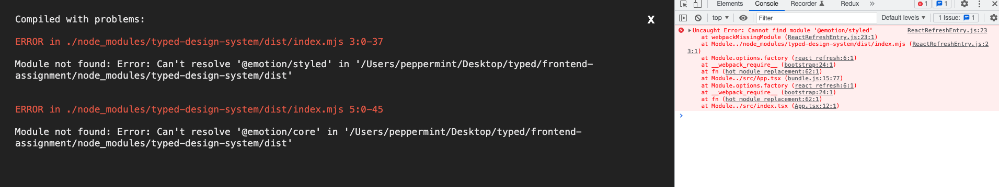

## 사용 라이브러리

- react
- typescript
- styled-components
- redux
- redux-thunk
- redux-devtools-extension

### resource 스토어 값

- `currentContent`
- `resourceList`

## typed-design-system 호환 관련

typed-design-system을 설치 후 바로 사용을 시도해보니 오류가 나타났습니다.
오류 원인은 디자인 시스템에 사용된 Emotion 라이브러리 호환 문제인 것 같습니다.
따라서 대안으로 Figma에서 아이콘을 export하여 처리하였습니다.

### 미구현 사항

- 리소스 등록 validation
